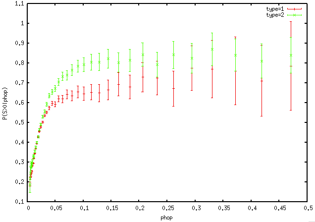

# RSoft 1.0

The following document is an introduction to the RSoft project. This 
project is meant to be a sharable softness code with slight 
modifications to structure functions listed in Cubuk et. al. PRL 2015.

Original code was written by Robert Ivancic. Please feel free to email
ivancic91 [at] gmail [dot] com. Publications with this code are
forthcoming.

## Structure function definitions

The structure functions currently calculated in this code come in two 
types:

<a href="https://www.codecogs.com/eqnedit.php?latex=G_{\text{R}}(i;&space;\mu,&space;L,&space;X,&space;Y)&space;=&space;\sum_j&space;\text{max}\left(e^{-(R_{ij}-\mu)^2/L^2}-\epsilon_{\text{R}},&space;0\right)" target="_blank"></a>

<a href="https://www.codecogs.com/eqnedit.php?latex=G_{\text{A}}(i;&space;\xi,&space;\lambda,&space;\zeta,&space;X,&space;Y,&space;Z)&space;=&space;\sum_{j,k}&space;\text{max}\left(e^{-(R_{ij}^2&plus;R_{jk}^2&plus;R_{ik}^2)/\xi^2}\left(\frac{1&plus;\lambda}{2}\right)^\zeta-\epsilon_{\text{A}},&space;0\right)" target="_blank"></a>

where most constants are defined in Cubuk et. al. PRL 2015 and <a href="https://www.codecogs.com/eqnedit.php?latex=\epsilon_i" target="_blank"></a> are the error tolerances for the radial (R) and angular (A) structure functions. These values should fall between 0 and 1; typically I have choosen 0.01 or 0.05. This formulation is used for two reasons. First, structure functions are smooth allowing for better interpretation of softness as an energy barrier for rearrangement (Schoenholz et. al. Nat. Phys. 2016). Second, it prevents unreasonable choices of parameters by the user.

## Installation

Here, we assume that installed you have (a) python 3 (b) anaconda, and
(c) git on your system.

**(Step 1)** Go to your home directory and clone this repository. This
can be done through the commands:

```bash
cd ~
git clone https://github.com/Ivancic91/RSoft
``` 

**(Step 2)** Create a conda environment. This will ensure that you can use
the packages you need without interfering with existing packages. You
may do this from the yml environment in the RSoft directory.

```bash
cd ~/RSoft
conda env create -f RSoft.yml
```

Make sure installation completed correctly by reading the conda output. 
To activate/deactive the RSoft environment, use the commands:

```bash
conda activate RSoft # For MacOS, use `source activate RSoft`
conda deactivate
```

**(Step 3)** Link c++ libraries, include the c++ headers, and add 
~/RSoft/RSoftPython to your PYTHONPATH. To do this, you can run:

```bash
cd ~/RSoft
python setup.py
source ~/.bashrc
```

Congratulations! You have installed RSoft.

## Tutorial

### Kob-Andersen

The following is a tutorial on how to develop a softness field for a
3D Kob-Andersen 80-20 mixture. 

**(Step 1)** Get data and convert it to an AMBER format. 

We have already run a LAMMPs simulation of this system with 1000 
particles for approximately 1 alpha relaxation time for you. Details
about the simulation can be found in the data directory of the
Kob-Andersen tutorial. For now, we are simply going to grab the 
trajectory and use it.

```bash
cd ~/RSoft/Tutorial/Kob-Andersen/
cp data/train/run.lammpstrj work/train.lammpstrj
```

Next, we will now copy a script to convert our trajectory to a AMBER 
(netCDF) file. Note that this script is written only for a Kob-Andersen
simulation and for other types of simulations and experiments it
may need to be modified. More information about the functions used in
this script may be found: https://ivancic91.github.io/LammpsIO/.

```bash
cp ~/RSoft/ARCHIVE/PYTHON/ConvDumpToNc_KA.py work
conda activate RSoft
cd work
python ConvDumpToNc_KA.py train.lammpstrj train.nc
``` 

It is important to note that AMBER style trajectories assume a 
*constant* number of particles in each frame. This assumption is not
limiting however because we can add *NaN* as the x, y, and z coordinate
of any particle which is not in the frame. Even though there are a 
constant number of particles in this example, the script used above
performs this operation and can be used as a template for experiments
and simulations with differing numbers of particles.

To check that the conversion completed correctly you may use the 
ncdump command which will print the contents of train.nc to the 
terminal.

```bash
ncdump -h train.nc
ncdump train.nc
conda deactivate
```

**(Step 2)** Evaluate a dynamic quantity for each particle and frame.

The traditional dynamic quantities used in softness development are 
<a href="https://www.codecogs.com/eqnedit.php?latex=D^2_{min}" target="_blank"></a>
in mechanically strained systems and <a href="https://www.codecogs.com/eqnedit.php?latex=p_{hop}" target="_blank"></a>
in quiescent systems. More information about both of these quantities
can be found in [Falk and Langer, Phy. Rev. E (1998)] and 
[Smessaert and Rottler, Phys. Rev. E (2013)] respectively. Because we
are not straining our Kob-Andersen glass we will simply use 
<a href="https://www.codecogs.com/eqnedit.php?latex=p_{hop}" target="_blank"></a>
for this analysis.

To do this, we are going to use some pre-written C++ code from the code
archive. This code is well-commented and may be modified if necessary.

```bash
cd ~/RSoft
cp ARCHIVE/STANDARD_ANALYSIS/CalcPhop.cpp RSoft_MAIN.cpp
```

We now will make an executable from RSoft_MAIN.cpp and move it to the 
work directory.

```bash
cd Debug
make all
mv RSoft.exe ~/RSoft/Tutorial/Kob-Andersen/work/Phop.exe
``` 

Finally, we will evaluate <a href="https://www.codecogs.com/eqnedit.php?latex=p_{hop}" target="_blank"></a>
for every particle at every frame of the training set. This function 
will cut off a few frames at the beginning and end of the trajectory
due to the rearrangement time [tR]. Note that basic usage for this 
executable can be found by executing the function with no arguments 
as shown below and detailed usage is shown in the C++ code comments. 

```bash
cd ~/RSoft/Tutorial/Kob-Andersen/work/
./Phop.exe                              # Shows basic usage
./Phop.exe train.nc 10 p p p phop.nc
```

The above code will take around 5 minutes to run. The parameter tR = 10
was taken from Schoenholz et. al. Nat. Phys. 2016.

I highly recommend viewing your results using OVITO to visualize your 
results here: https://www.ovito.org. It may be used to color particles
by their <a href="https://www.codecogs.com/eqnedit.php?latex=p_{hop}" target="_blank"></a>
values to ensure results are reasonable.

**(Step 3)** Generate an RSoftSF file *with* particles evaluated.

We now wish to evaluate a set of structure functions for every particle
and every frame. In order to do this, we need to tell RSoft which 
structure functions we want to evaluate. We do this by providing it an
RSoftSF file *without* particles evaluated. This file is simply a list
of the structure function parameters we wish to use in our softness 
calculation.

You may generate your own RSoftSF file using RSoftPython 
(https://ivancic91.github.io/RSoft/modules.html#). An example script is
available in ~/RSoft/ARCHIVE/PYTHON/MakeRSoftSF.py. In this tutorial,
we are simply going to use a pre-made set of structure functions for a
bi-dispersed system where the large particle diameter is 1. I
highly encourage the use of these "canned" structure function sets 
because (a) typically unless your system is unusual, these 
structure functions perform relatively well, (b) use of these sets of 
structure functions may allow for quantitative comparisons between 
various simulations and experiments, and (c) it is easy to make 
mistakes when choosing structure functions that lead to a noisy 
softness fields or lead to slow calculations (see FAQs below).

To get a pre-made set of structure functions, we will copy them from 
the archive.

```bash
cd ~/RSoft/Tutorial/Kob-Andersen/work/
cp ~/RSoft/ARCHIVE/RSoftSF/bidispersed_radial_short.SF.nc KA.SF.nc
```

We can now make an executable to evaluate these structure functions 
for all particles in phop.nc. There is pre-made, well-documented code
in the ARCHIVE to do this. We will simply follow the similar steps we
used to make the phop executable.

```bash
cd ~/RSoft
cp ARCHIVE/RSoft/CalcSF.cpp RSoft_MAIN.cpp
cd Debug
make all
mv RSoft.exe ~/RSoft/Tutorial/Kob-Andersen/work/CalcSF.exe
```

We can now run this executable. Again basic usage for this
executable can be found by executing the function with no arguments
just as with phop.

```bash
cd ~/RSoft/Tutorial/Kob-Andersen/work/
./CalcSF.exe                                   # Shows basic usage
./CalcSF.exe phop.nc KA.SF.nc p p p phop.SF.nc
```

The above code will take around 1 minute to run. The result, phop.SF.nc
is a RSoftSF file in which all of the structure functions listed in 
KA.SF.nc are evaluated for every particle in phop.nc. Therefore, 
phop.SF.nc is an RSoftSF file *with* particles evaluated. *NOTE:* even
though this is a relatively small file with relatively few structure 
functions the size of phop.SF.nc is 182M! File sizes for these files
can typically run several gigabytes. This is typically not much of a
limitation, however, because this file can (and should) be deleted
after training has occured.

**(Step 4)** Traditional approach to training.

We will now attempt to train a softness field using the cannonical 
method that is well described in Schoenholz et. al. Nat. Phys. 2016.
Here, we pick a high cutoff in phop above which we say a particle has
"rearranged". We also choose a lower cutoff and a long time period. If
a particle is below the lower cutoff for the time period, we say that
it has "not rearranged". The idea is to then separate these two sets 
(which are taken to be sampled to be equal in size) and separate their
structure functions with a linear SVM.

This is all implemented via the RSoftPython code using sklearn. An
example script is provided in the ARCHIVE. One provides this script 
with an RSoftSF file with particles evaluated as as well as a 
corresponding AMBER file with some sort of dynamics (phop, D2min, ect)
is evaluated for each particle. An example script is provided in the 
ARCHIVE.

```bash
cd ~/RSoft/Tutorial/Kob-Andersen/work/
cp ~/RSoft/ARCHIVE/PYTHON/TrainPlane.py .
conda activate RSoft
python TrainPlane.py
```

This code will output an RSoftPlane file. This file has everything one
needs to create a softness field. You may view the contents of this 
file using ncdump.

```bash
ncdump KA.plane.nc
conda deactivate
```

Note that two hyperplanes have been trained; one for type 1 and one 
for type 2 particles. More information about the training function can
be found at https://ivancic91.github.io/RSoft/.

**(Step 5)** Testing the softness field.

We would now like to test our softness results on a set of independent
data. To do this we will calculate a phop and softness field for a set
of independent test data. We start by making an executable to calculate
softness quickly. 

```bash
cd ~/RSoft/
cp ARCHIVE/RSoft/CalcSoft.cpp RSoft_MAIN.cpp
cd Debug
make all
cp RSoft.exe ~/RSoft/Tutorial/Kob-Andersen/work/CalcSoft.exe
```

Now let's take some independent "test" data that we generated in 
LAMMPS, convert it to AMBER format, and evaluate phop on it. 

```bash
cd ~/RSoft/Tutorial/Kob-Andersen
scp data/test/run.lammpstrj work/test.lammpstrj
cd work
./Phop.exe test.nc 10 p p p phop_test.nc
./CalcSoft.exe phop_test.nc KA.plane.nc p p p soft_test.nc
```

One basic test of a softness field is to plot the probability that
a particle is soft given a certain dynamical value, i.e. <a href="https://www.codecogs.com/eqnedit.php?latex=P(S>0|p_{hop})" target="_blank">0|p_{hop})" title="P(S>0|p_{hop})" /></a>
. This plot (which can be made for both types of particles) typically 
monotonically increases to some value. We may interpret this value as
the maximum predictive strength of softness given a particular set of 
structure functions and training method. Other simple tests can be 
found in published results.

```bash
cp ~/RSoft/ARCHIVE/PYTHON/PSoftGivenPhop.py .
conda activate RSoft
python PSoftGivenDynamics.py
conda deactivate
```

This will provide two datasets where the first column is phop and the
second is P(S>0|phop). The third column is an error estimate. The data
should look roughly like this:



The output of the code gives a couple of quick numbers to quantify the 
resulting hyperplane as well. An example of the output is below:

```bash
TYPE = 1
  Percentage of rearranging particles that are soft:
  P(S>0|R) = 0.7292682926829268
  Percentage of particles that are soft:
  P(S>0) = 0.3126770938446014
TYPE = 2
  Percentage of rearranging particles that are soft:
  P(S>0|R) = 0.8383102694828842
  Percentage of particles that are soft:
  P(S>0) = 0.0979757820383451
```

The idea here is that if the percentage of the rearranging particle
that are soft is high, but the total percentage of particles that
are soft is low, the quality of the hyperplane is good. Typically,
people publish numbers similar to these and you can see how your numbers
match up against other people's numbers.

In this case, the type 2 particle plane is okay; maybe a little worse
than typical accuracies people quote of around 85-90%, but the type
1 particles are significantly worse. Poor hyperplane development occurs
for one of three reasons. 

First, the chosen structure functions may be poor descriptors of the 
particle's local environment. This may mean that you need to add more of 
the standard structure functions or you may need to add your own 
structure functions. One common example of this is in polydispersed 
experimental systems; it's been found that adding the particle's radii 
as a structure function is usful in these situations. 

Second, you may not have provided the SVM clear enough examples of 
rearranging and non-rearranging particles. This could mean that the set 
of parameters which characterize your dynamics are not very good 
(for example [tR] in this case), or it could mean that your training 
parameters are not very good (the rearrangement threshold is too small,
the timescale to dictate a non-rearrangement is too short, the 
non-rearrangement cutoff is tol large). These can be easily tweeked by
changing the TrainPlane.py file.

Third, you may not have enough rearranging particle examples. Because
the hyperplane is a fit to the training data, if you do not have enough
training data your hyperplane will be poor. You may test this by 
building hyperplanes with less data and checking their test-set 
accuracy. If you have enough training data so that your test-set 
accuracy has flattened out, you have enough training data. 

I suspect the problem with this data is that (a) the non-rearrangement
timescale is a little short for the type 1 (large) particles (only 1/2
of an alpha-relaxation time) and (b) that the structure functions around
these particles are fairly short-ranged. If you want you can try, fixing
these problems yourself as an exercise!

## FAQs

- **How do I only train/calculate softness in a particular region of my
experiment or simulation?**

- **How do I determine which structure functions to use?**

- **Why is my softness calculation so slow?**

## Documentation

- **RsoftTools** : This is a set of python code used extensively to perform the less computationally intensive parts of the softness calculates. Documentation is available here: https://ivancic91.github.io/RSoft/

- **LammpsIO** : This is a set of python code that was re-written in C++ for this project. It allows for quickly inputing and outputing LAMMPS style dump and AMBER files. It is provided during the installation of Rctivate RSoft
python TrainPlane.py
conda deactivateSoft. Complete documentationis provided here: https://ivancic91.github.io/LammpsIO/

- **AMBER** : A file format based on netCDF that was developed for storing data generated by molecular dynamics simulations. More information about this format is available here: http://ambermd.org/netcdf/nctraj.xhtml

- **OVITO** : A molecular dynamics visualization tool. It is an easily downloadable GUI and can be used to visualize AMBER and LAMMPS dump files quickly and painlessly: https://www.ovito.org

## Publications
